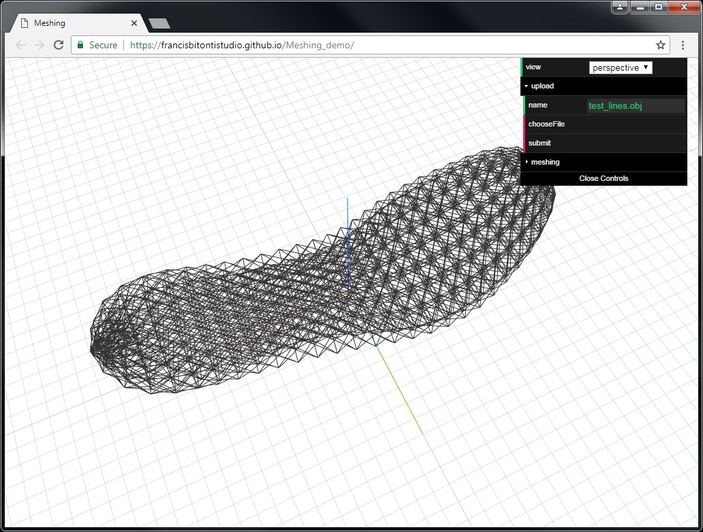
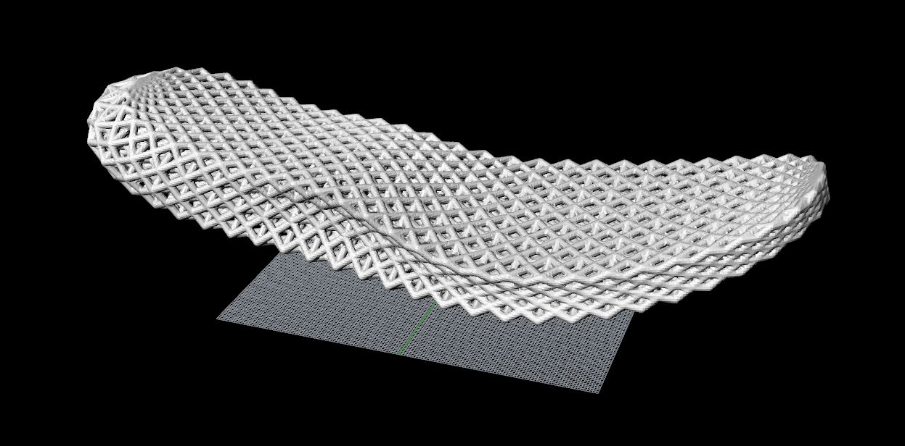

# Meshing_demo

### <a href='https://francisbitontistudio.github.io/Meshing_demo/'>Live demo</a> 

### <a href='https://drive.google.com/open?id=1S-kPNRyWH5Q7R0NdnzrWHPnlcsG0RXBg'>Example lines obj</a> 

### 1. Upload OBJ lines

The demo accepts lines in obj format. Select file and then click on Submit. Sucessfully upload file will be displayed on screen

  

### 2. Run meshing algorithm from server

Choose desired resolution and member thickness (Radius). Click 'Run' to start computing. 
It could take 1 or 2 mins for very large files. After finished, a txt file with downloading URLs will be returned.
It is also possible to mesh previous uploaded lines obj files by specifying the field 'lines'

  

### 3. Check result in other CAD softwares

The result stl files can be viewed in other softwares, due to the fact meshing result file could often be very large,
thus in-browser visualization of the file is purposely disabled in this case. 

  

